# 实验项目1：接管裸机的控制权

[TOC]


## 实验题目

接管裸机的控制权


## 实验目的

* 熟悉虚拟机的安装、配置、使用；
* 搭建和应用实验环境，了解各种工具的使用；
* 编写NASM汇编程序；
* 接管裸机的控制权。


## 实验要求

### 任务一：搭建和应用实验环境

虚拟机安装，生成一个基本配置的虚拟机XXXPC和多个1.44MB容量的虚拟软盘，将其中一个虚拟软盘用DOS格式化为DOS引导盘，用WinHex工具将其中一个虚拟软盘的首扇区填满你的个人信息。


### 任务二：接管裸机的控制权

设计IBM_PC的一个引导扇区程序，程序功能是：用字符‘A’从屏幕左边某行位置45度角下斜射出，保持一个可观察的适当速度直线运动，碰到屏幕的边后产生反射，改变方向运动，如此类推，不断运动；在此基础上，增加你的个性扩展，如同时控制两个运动的轨迹，或炫酷动态变色，个性画面，如此等等，自由不限。还要在屏幕某个区域特别的方式显示你的学号姓名等个人信息。将这个程序的机器码放进放进第三张虚拟软盘的首扇区，并用此软盘引导你的XXXPC，直到成功。


## 实验方案

**实验中用到的工具列表**

* 操作系统：Windows 10
* 代码编辑器：Visual Studio Code 1.32.1
* 二进制文件编辑器：WinHex 14.2
* 磁盘工具：WinImage 9.00
* 虚拟机软件：VMware Workstation 15 Pro
* 终端：cmder v1.3.11
* Linux 环境：WSL Ubuntu, 4.4.0-17763-Microsoft
* 汇编编译器：NASM 2.11.08 (On Linux)


### 任务一：搭建和应用实验环境

该任务比较基础，此处仅简述试验方案。**详细流程参见“实验过程”栏目**。

* 虚拟机的安装，使用 VMware Workstation 15 Pro 软件，并按照流程创建一个最低配置（1个单核处理器，4MB内存，无网络）的裸机环境。
* 使用`WinImage`工具创建虚拟软盘文件。
* 使用`WinHex`工具修改虚拟软盘的内容。
* 制作 MS-DOS 引导镜像，用 VMware 加载。


### 任务二：接管裸机的控制权

字符反射运动的汇编程序已经提供了（`stoneM.asm`），我只在其的基础上进行功能扩充和代码优化。下面简述我的试验方案：

1. **规范化汇编程序**

   1. 经查阅资料得知，系统启动并自检完成后，会将软盘的第一个扇区中的内容读入内存地址`0000:7C00`中，接着检查扇区末尾的两个字节是否等于`0x55和0xAA`，如果是，则说明该扇区为有效的主引导记录。

      因此，在汇编程序中应规定被装入的内存地址为`0x7C00`，且第511、512个字节必须是0x55和0xAA。

      > 注意，源程序中为`org 100h`，是错误的，必须更正。

   2. 改写已提供的汇编程序，命名为`jed_stone.asm`。开头部分加入如下指令，可以使程序装载到正确的位置：

      ```assembly
      org 7C00h
      ```

   3. 在`jed_stone.asm`结尾处添加如下代码：

      ```assembly
      times 510-($-$$) db 0   ; 填充0，一直到第510字节
      db 55h, 0AAh            ; 扇区末尾两个字节为0x55和0xAA
      ```

      这两行代码的作用是将程序的剩余部分用0填充，直到第510个字节。之后，填充第511和第512个字节为0x55和0xAA。这样子编译出的程序机器码将正好是512字节。

      

2. **添加字符变色功能**

   1. 在研究了字符反射的原理后得知，每次显示一个处于新位置的字符时，程序都会转到标签`show`处去执行。因此要使字符变色，只需要在每次显示字符前改变其属性即可。

      字符属性是保存在一个字节中的（详见“实验总结”栏目），为了使得每次显示字符的属性不同，需要将字符属性保存在内存中的一个位置：

      ```assembly
      curcolor2 db 09h        ; 保存当前字符颜色属性，用于移动的字符
      ```

   2. 在`show`中添加内容，使字符属性每次递增以改变颜色。但为了只改变前景色而不改变背景色，需要让字符属性在`0x01`和`0x0F`之间变化：

      ```assembly
      show:
          xor ax,ax               ; 计算显存地址
          mov ax,word[x]
          mov bx,80
          mul bx
          add ax,word[y]
          mov bx,2
          mul bx
          mov bp,ax
          mov ah,[curcolor2]      ; 弹字符的背景色和前景色（默认值为07h，详见文档）
          inc byte[curcolor2]
          cmp byte[curcolor2], 0fh
          jnz skip
          mov byte[curcolor2], 1  ; 为了不改变背景色
      skip:
          mov al,byte[char]       ; AL = 显示字符值（默认值为20h=空格符）
          mov word[gs:bp],ax      ; 显示字符的ASCII码值
      ```

      

3. **在屏幕顶端显示个人信息**

   1. 将个人信息字符串以及字符串的长度保存在内存中：

      ```assembly
      myinfo db '                             Zhang Yixin, 17341203                            '
      infolen dw $-myinfo     ; myinfo字符串的长度
      ```

   2. 我们已经学会如何在屏幕指定位置显示1个字符，那么只需使用循环结构就可以显示多个字符（也就是显示字符串）。代码如下，同样加在`show`后面：

      ```assembly
          mov si, myinfo          ; 显示姓名和学号
          mov di, 2
          mov cx, word[infolen]
      loop2:                      ; 显示myinfo中的每个字符
          mov al, byte[ds:si]
          inc si
          mov ah, [curcolor]      ; 背景色和前景色
          add byte[curcolor], 12h ; 变色，该数字可随意调节以达到不错的效果
          mov word [gs:di],ax
          add di,2
          loop loop2
      ```

   3. 为个人信息的显示添加炫酷变色效果。与字符变色的原理类似，同样采取保存字符属性、每次显示前递增字符属性的方法。与之不同的是，这里允许背景色、前景色都可以改变。此处略去。

      

4. **安装和配置编译环境**。我使用`VS Code`+`cmder`+`WSL`(Windows Subsystem for Linux)+`NASM`作为开发环境。这些工具的安装不在此处叙述。

   工具准备就绪后，在`jed_stone.asm`目录下打开`cmder`并进入`bash`。使用NASM编译并生成机器码。生成的文件应该以`.img`为后缀，可以直接作为 VMware 的软盘镜像使用。

   ```bash
   nasm jed_stone.asm -o jed_stone.img
   ```

   此时若没有错误提示出现，则说明成功！如下图所示：

   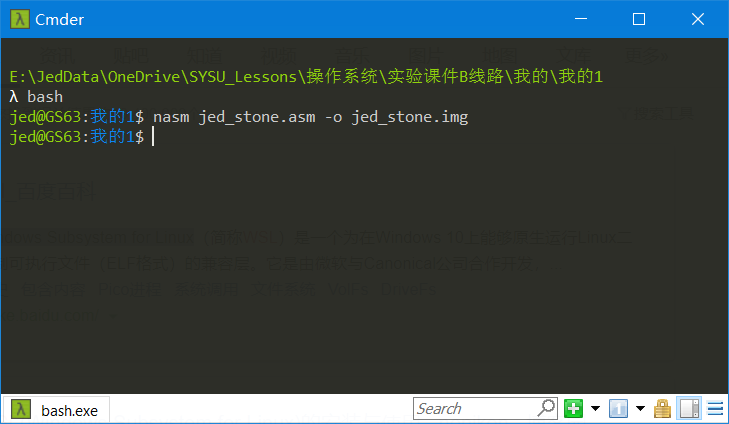

   

5. 将生成的`jed_stone.img`作为 VMware 的软盘镜像。设置方法如图：

   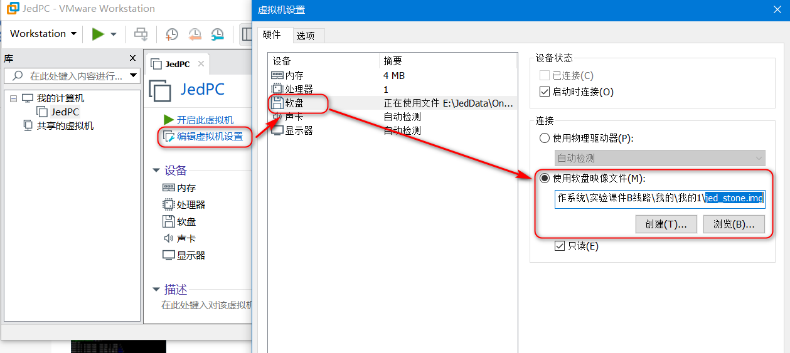

   

6. 准备工作全部完成，可以正式开始实验了！


## 实验过程

### 任务一：搭建和应用实验环境

1. **虚拟机的安装**

   1. 下载安装好 VMware Workstation 15 Pro。

   2. 打开 VMware 主界面，点击【文件】-【新建虚拟机】-【自定义】，在后续步骤中，操作系统和版本选择“其他”，虚拟机命名为`JedPC`。处理器数量、内核数量均设置为1，虚拟机内存设置为4MB，其他设置保持默认。

   3. 在虚拟硬件中添加一个`软盘驱动器`备用。为了避免麻烦，将`网络适配器`移除掉（可选的步骤）。最终，虚拟机设置如图所示：

      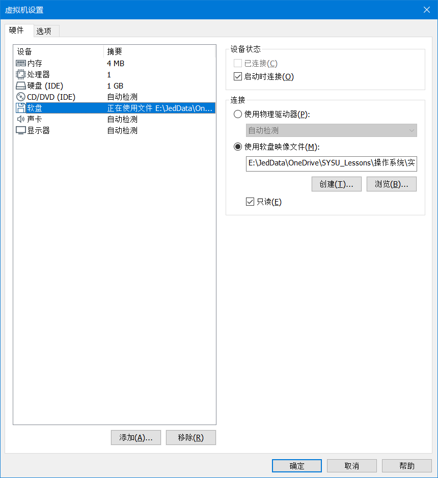

      

   4. 至此虚拟机创建完成，尝试开机，提示“Operating System not found”，如图所示。这是意料之中的结果。

      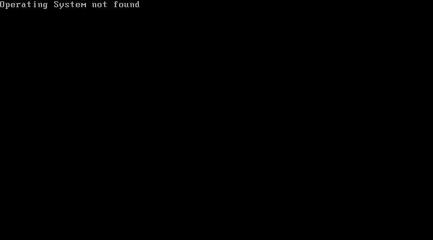

      

2. **制作1.44MB虚拟软盘，并格式化为 DOS 引导盘**

   1. 下载 MS-DOS 6.22 镜像`DOS622.IMG`，并为其创建一个新的虚拟机。创建一个软盘驱动器，将 DOS 镜像加载。

      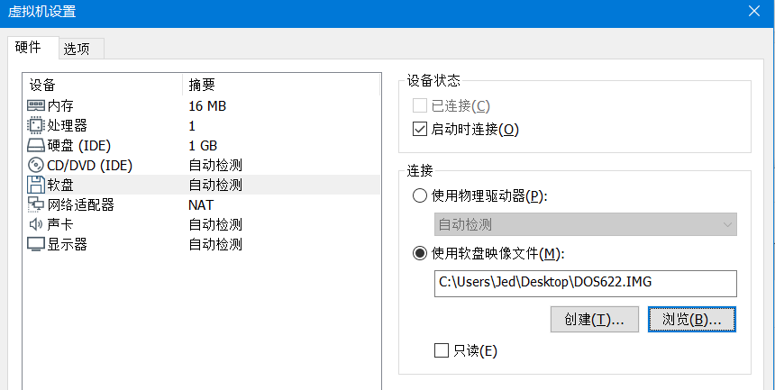

   2. 打开 `WinImage`，制作一个空的 1.44 MB软盘镜像文件`empty.flp`。

      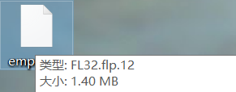

      

   3. 回到虚拟机，再添加一个软盘驱动器，将这个空的镜像文件加载。

      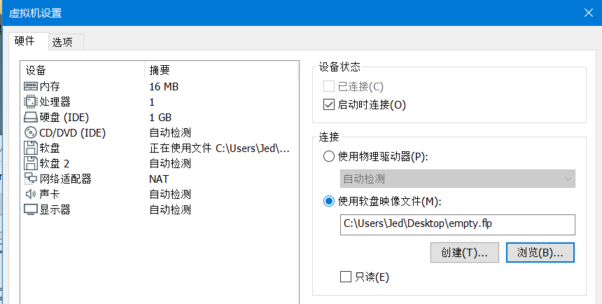

   4. 开启虚拟机，依据提示安装 DOS 系统。如图，很快便安装好了：

      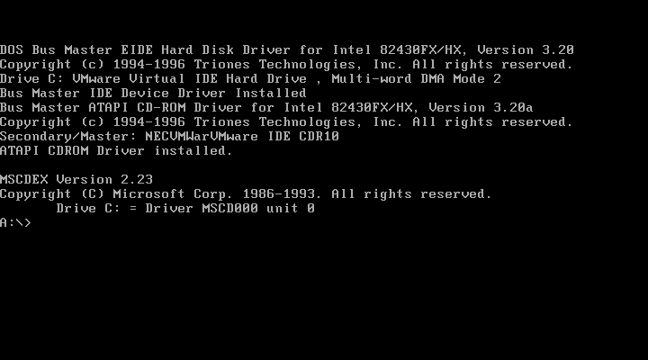

      

   5. 此时，`A:`为 DOS 安装盘，`B:`是刚刚添加的空软盘，即`empty.flp`。使用以下命令格式化该软盘。

      ```powershell
      format b:
      ```

      按提示操作，如图：

      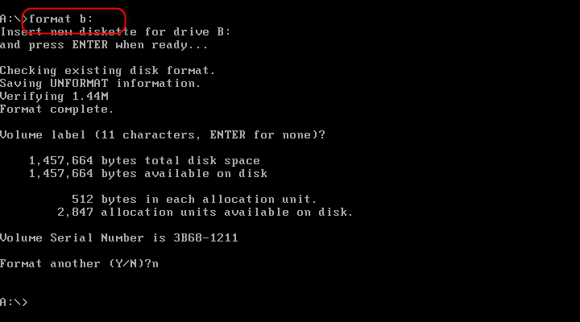

      

   6. 对比格式化前后`empty.flp`文件内容的变化。以下截图来自`WinHex`工具：

      格式化前，内容是由`WinImage`默认填充的。格式化后，变为 DOS 的特有格式：

      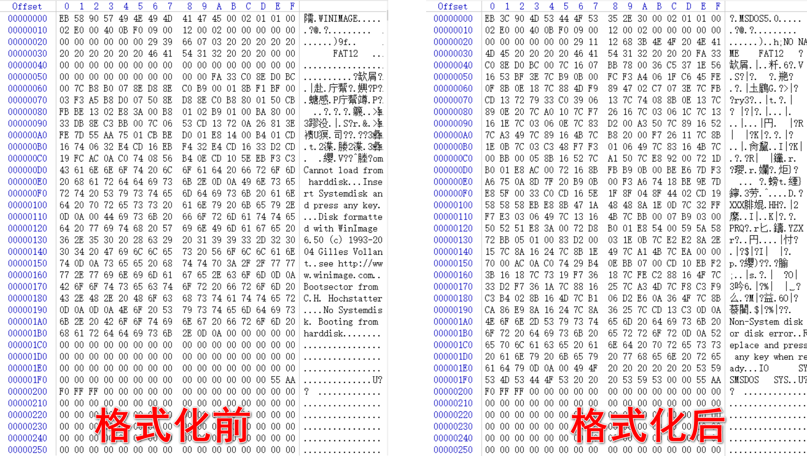

      

   

3. **制作1.44MB虚拟软盘，并在首扇区填满个人信息**

   1. 首先使用`WinImage`工具制作一个1.44MB软盘镜像文件。

   2. 用`WinHex`打开。首扇区即为前512个字节，在这段空间内使用【剪贴板写入】功能将自己的个人信息写入进去。注意扇区末尾的两个字节应为`0x55 0xAA`。

      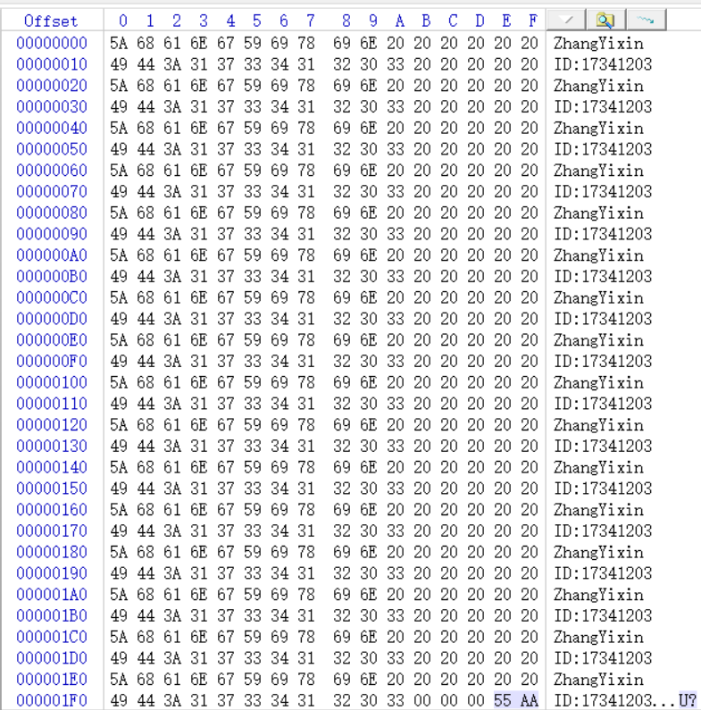

      


   3. 保存文件。


### 任务二：接管裸机的控制权

1. 按照“实验方案”栏目中的步骤创建好`jed_stone.img`软盘镜像文件并将其设置在 VMware 中的虚拟软盘镜像后，开启虚拟机，无需其他操作即可看到效果。以下随意截取三张屏幕截图：

   * 开机约3秒的截图：

     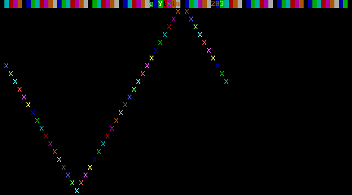

   

   * 开机约10秒的截图：

     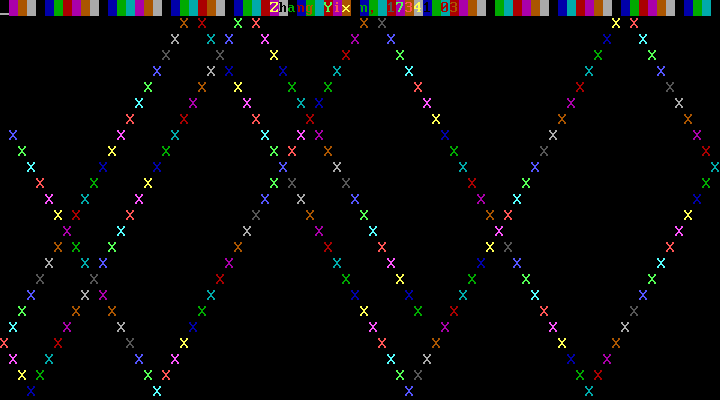

   

   * 开机约50秒的截图：

     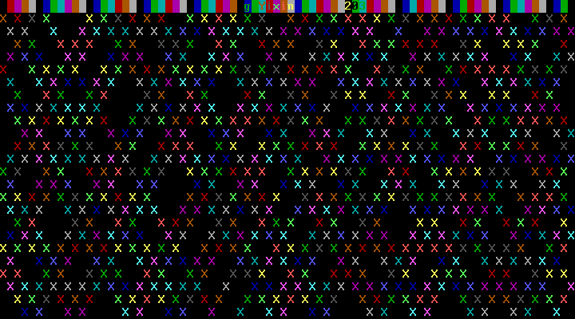

   

## 实验总结

### 警示与技巧

* 3.5寸软盘容量的计算如下：

  > 80（磁道）x18（扇区）x512 bytes(扇区)x2（双面） = 1440 x1024 bytes = 1440 KB = 1.44MB

  并非`1.44*1024*1024`，在创建磁盘文件的时候需要注意这个小问题，从而保持严谨性。

  

* 主引导记录扇区的末尾两个字节必须是`0x55`和`0xAA`，可以每次生成img文件后再用`WinHex`手动添加这两个字节，不过这样做太麻烦了。

  一种不错的方法是，在汇编文件末尾加上这两条伪指令：

  ```assembly
  times 510-($-$$) db 0 ; 填充0，一直到第510字节
  db 55h, 0AAh          ; 扇区末尾两个字节为0x55和0xAA
  ```

  其中`$-$$`是汇编中的一个常用技巧，它代表“本扇区到目前为止的字节数”。

  

* 如何对屏幕字符的背景色和前景色进行控制？每个字符的显示由2个字节表示，低字节是字符的ASCII码，高字节是字符的颜色属性。对于颜色属性的1个字节，从高到低的8个比特位依次用字母表示为：`KRGBIRGB`，高四位控制背景色，低四位控制前景色，如下表：

  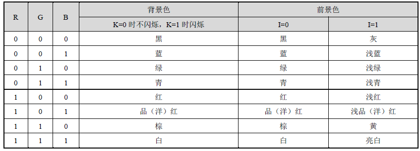


### 心得与体会

尽管我早有使用虚拟机的经验，不过之前都是运行现成的操作系统。在裸机（虚拟的裸机）上跑程序还是第一次。

开始设计实验方案前，“接管裸机的控制权”这一任务看似十分困难，因为我完全不理解计算机是如何开机的、如何自举的，刚刚上电时计算机的CPU、内存将做什么操作等等。不过后来通过上课、查阅资料、与同学讨论，我逐渐填补了知识上的漏洞，懂得了计算机开机时会去哪个设备的哪个扇区，将多少数据传送到内存中的哪个单元；还学会了以文本方式在显示器上显示字符和字符串，甚至还直到如何改变字符的颜色和背景。

在之前的计算机组成原理课程中，我虽然学过一点 x86 汇编的知识，可是真正上手编程的机会并不是很多。通过本次实验，我学习了 NASM 汇编的格式、伪指令等知识。在程序末尾使用`times`伪指令来填充数据是我学到新的 NASM 汇编知识的一个例子。


### 疑惑与问题

* 都说主引导扇区末尾两个字节必须是 55AA。可是当引导程序不足512个字节时（此时第511和512个字节当然不是55和AA，因为它们根本不存在），虚拟机仍然可以正确引导程序。


## 参考资料

1. [Linux dd命令 | 菜鸟教程](http://www.runoob.com/linux/linux-comm-dd.html)
2. [软盘_百度百科](https://baike.baidu.com/item/软盘/963560)