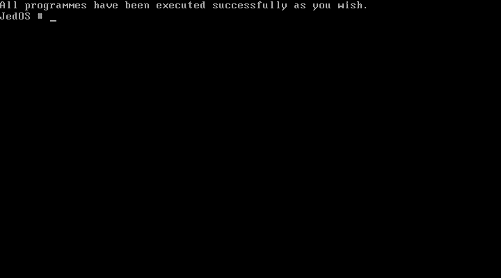
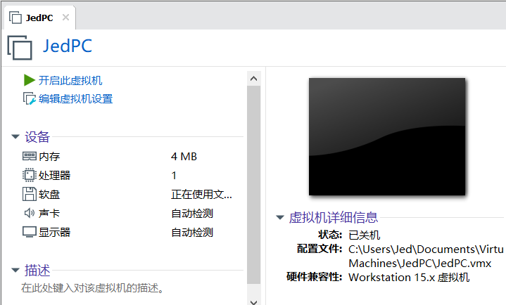

# 实验项目3：开发独立内核的操作系统


## 实验题目

开发独立内核的操作系统


## 实验目的

1. 掌握TASM汇编语言与TURBO C语言汇合编程的方法；
2. 实现内核与引导程序分离，掌握软盘上引导操作系统方法；
3. 设计并实现一种简单的作业控制语言，建立具有较友好的控制命令的批处理原型操作系统，掌握操作系统提供用户界面和内部功能的实现方法。

## 实验要求

* 用C和汇编实现操作系统内核；

* 增加批处理能力：
  * 提供用户返回内核的一种解决方案；
  * 一条在内核的C模块中实现：
    * 在磁盘上建立一个表，记录用户程序的存储安排；
    * 可以在控制台查到用户程序的信息，如程序名、字节数、在磁盘映像文件中的位置等；
    * 设计一种命令，命令中可加载多个用户程序，依次执行，并能在控制台发出命令；
    * 在引导系统前，将一组命令存放在磁盘映像中，系统可以解释执行。


## 实验方案

### 特色

**实验中用到的工具列表**

- 物理机操作系统：Windows 10
- 虚拟机软件：VMware Workstation 15 Pro
- 代码编辑器：Visual Studio Code 1.32.3
- Linux 环境：WSL Ubuntu, 4.4.0-17763-Microsoft
- 汇编编译器：NASM 2.11.08 (On Linux)
- C 语言编译器：GCC 5.4.0
- 链接器：GNU ld 2.26.1


**优化开发环境**

- 使用 WSL，方便在 Windows 下进行代码编辑，然后在 Linux 下进行编译整合，最后在 VMware 中运行镜像。因为 WSL 可以直接访问主机的文件系统，因此这种方式使得文件互通没有阻碍。
- 用 Shell Script 实现自动化部署。


### 方案概述

我使用 gcc + nasm + ld 方案，而不是 ~~tcc + tasm + tlink~~。

首先要明确的是，gcc 与 nasm 完全可以混合编译运行在**实模式**下的操作系统内核，只需要添加合适的参数即可。为了生成兼容 16 位的代码，需要在汇编文件头部加上`BITS 16`说明符。编译和链接时使用如下参数：

```bash
# 汇编程序
nasm -f elf32 源文件.asm -o 目标文件.o

# C 程序
gcc -c -m16 -march=i386 -masm=intel -nostdlib -ffreestanding -mpreferred-stack-boundary=2 -lgcc -shared  源文件.c -o 目标文件.o

# 链接
ld -m elf_i386 -N -Ttext 0x8000 --oformat binary 源文件1.o 源文件2.o ... -o 目标文件.bin
```


要想将 C 语言和汇编语言混合编译，实现函数的相互调用，必须了解函数声明、作用域、调用过程、参数传递和返回值等这些过程。这里做一个简单描述：

* **C 语言中调用汇编编写的函数**

  使用普通方法再汇编程序中定义函数，再汇编程序的头部加上：

  ```assembly
  global asm_function
  ```

  C 程序中头部要显式声明此函数

  ```c
  extern void asm_function();
  ```

* **汇编中调用 C 语言编写的函数**

  直接在 C 中定义函数，不需要其他额外操作。在汇编程序头部加上：

  ```assembly
  extern c_function
  ```

* **参数传递和返回值**

  对于 C 函数

  ```c
  uint16_t c_func(uint16_t a, uint16_t b);
  ```

  函数调用时会先将参数`b`压栈，再将参数`a`压栈。注意栈由高地址向低地址方向增长，在汇编语言中可以利用`sp`和`bp`寄存器来访问到栈中的变量，具体方法见代码及其注释。

  返回值是通过`ax`寄存器传递的，具体方法见代码，注释中有详细的说明。


### 软盘扇区安排说明

我是按照这张表格来组织安排软盘中的内容的。注意扇区号从 1 开始。

| 扇区号 | 扇区数（大小） | 内容                 |
| ------ | -------------- | -------------------- |
| 1      | 1（512 B）     | 引导程序             |
| 2      | 1（512 B）     | 存放用户程序信息的表 |
| 3~10   | **8（4 KB）**  | 操作系统内核         |
| 11~12  | 2（1 KB）      | 用户程序1            |
| 13~14  | 2（1 KB）      | 用户程序2            |
| 15~16  | 2（1 KB）      | 用户程序3            |
| 17~18  | 2（1 KB）      | 用户程序4            |

注意到我使用了 3~10 这 8 个扇区（共 4KB）来存储操作系统内核，这么做的原因一是方便用户程序从第 11 号扇区开始，方便管理；二是方便扩展功能。

用户程序 1~4与 实验项目2中的相同，都是是动态反射输出字符，位置分别是左上角、右上角、左下角、右下角。


### 引导程序

源代码见`bootloader.asm`。

与项目1、项目2的引导程序大同小异（注：我在项目2中已经采用了引导程序与操作系统分离的实现方法了）。

引导程序需要完成三件工作：

1.**显示提示信息**。方法是使用BIOS的`int 10h`功能调用；2.**加载用户程序信息表到内存中**。这张表中存放了用户程序的个数、名称、大小等信息，需要将其加载到内存中，以备操作系统调用用户程序前查询；3.**加载并跳转到操作系统内核**。使用`int 13h`读软盘，使用`jmp`无条件转移指令来跳转。

注意引导扇区的末尾必须是 55AA：

```assembly
SectorEnding:
    times 510-($-$$) db 0
    db 0x55,0xaa            ; 主引导记录标志
```

引导程序使用 nasm 单独编译，成为一个 512 字节的独立文件。它不需要与 C 程序混编，因此也就不需要先编译再链接。


### 用户程序信息表

源代码见`usrproginfo.asm`。

这是一张数据表，采用汇编实现，且汇编文件中**不存在任何指令性语句**，全部都是数据定义`dw`、`db`等。该表由引导程序`bootloader`负责装入内存，由操作系统内核中的`getUsrProgNum`、`getUsrProgName`、`getUsrProgSize`、`getUsrProgSector`、`getUsrProgAddr`等函数读取出来。这些函数定义在`liba.asm`文件中，并且有详细的注释。

下面介绍我设计的用户程序信息表的结构。

首先用2个字节存用户程序的数目，如本项目中有4个用户程序，那么就存数字4。接下来是4个用户程序的信息，每个用户程序的信息格式相同，分别占用40个字节。结构如下：

```assembly
UsrProg1:                    ; 每个用户程序信息占用40字节
    pid1 dw 1                ; 程序编号；相对偏移0
    name1 db 'stone_topleft' ; 程序名（至多32字节）；相对偏移2
    times 32-($-name1) db 0  ; 程序名要填满32字节
    size1 dw 1024            ; 程序大小；相对偏移34
    sector1 dw 11            ; 起始扇区；相对偏移36
    addr1 dw 0xA300          ; 内存中的地址；相对偏移38
```

用户程序信息表是静态的，在编译前已经定义好。在后续的项目中会将其设计成动态的。用户程序信息表使用 nasm 单独编译，成为一个 512 字节的独立文件。


### 内核

内核的源代码在以下几个文件中，功能全部由本人独立完成：

| 文件名       | 名称   | 格式 | 内容简介                                                     |
| ------------ | ------ | ---- | ------------------------------------------------------------ |
| oskernel.asm | 内核   | ASM  | 显示操作系统信息，提示用户进入 shell                         |
| liba.asm     | 汇编库 | ASM  | 包含了若干使用汇编语言编写的函数，可供汇编或C程序调用        |
| libc.c       | C 库   | C    | 包含了若干使用 C 语言编写的函数，可供汇编或C程序调用         |
| stringio.h   | C 库   | C    | 被`libc.c`包含，内有涉及字符串、键盘输入、屏幕输出等功能的实现代码 |


在“实验要求”中有一条说明要设计一种命令，于是我决定设计一个简单的**shell**，可以供与用户进行交互。这个shell需要具有**显示提示信息**、**接受用户输入**、**识别命令和识别参数**、**执行操作**、**返回shell**等基本功能。

在`libc.c`中的`shell()`函数的主体是一个无限循环，不断地接受命令、执行命令或报错。接受命令、处理命令、执行命令的过程中需要用到大量的字符串处理，字符串函数都在`stringio.h`中。我的shell目前支持以下命令：

| 命令     | 功能                                                         |
| -------- | ------------------------------------------------------------ |
| help     | 显示shell基本信息和支持的命令及其功能                        |
| clear    | 清屏                                                         |
| list     | 显示可以运行的用户程序                                       |
| run      | 按顺序批量地执行用户程序，可以执行一个或多个程序，如`run 1`执行用户程序1；`run 1 2 3`依次执行用户程序1、用户程序2、用户程序3。 |
| poweroff | 强制关机                                                     |

※ 其中最重要也是最复杂的命令分别是`list`和`run`。下面分别说明实现方法：

* ***list***：源代码是`libc.c`文件中的`listUsrProg()`函数。该命令从用户程序信息表（第2个扇区）中读取**用户程序名称**、**大小**、**在内存中的地址**、**在软盘中的扇区**这些信息，然后显示出来。涉及到的函数是`getUsrProgNum`、`getUsrProgName`、`getUsrProgSize`、`getUsrProgSector`、`getUsrProgAddr`。除了`getUsrProgNum`无参数外，其余函数均接受用户程序编号 PID 作为参数，然后返回相应的信息。这些函数使用汇编语言实现（`liba.asm`），并由 C 语言调用。函数定义处有详细的注释。

* ***run***：源代码是`liba.a`文件中的`loadAndRun`函数，它用汇编语言定义，由 C 语言调用，对应的函数原型如下。三个参数依次是：*起始扇区*、*扇区数*、*存入内存中的地址*。

  ```c
  extern void loadAndRun(uint16_t sector, uint16_t len, uint16_t addr);
  ```

  `run`命令不仅可以只接受一个参数，还可以接受多个参数从而按照参数顺序依次执行用户程序，正所谓“批处理系统”。首先，检查参数是否有效，如果参数中出现了无效的字符（非数字或空格），那么直接显示一条错误信息并回到 shell，并不会执行任何用户程序。如果参数是有效的，才会进入批处理。

  下面列举一些有效和无效的命令：

  ```shell
  # 有效的
  run 1      # 执行用户程序1
  run 1234   # 依次执行用户程序1、2、3、4
  run 1 2 1  # 依次执行用户程序1、2、1
  
  # 无效的
  run        # 没有参数
  run abc    # 字母是无效参数
  run 1 b 2  # 字母是无效参数
  run1       # 命令与参数之间没有空格
  ```

  下面说明执行用户程序采用的方法：

  这项功能在 C 中用一个 while 循环实现——遍历 run 后参数的每一个字符，如果是数字的话就跳转到相应的用户程序，否则继续遍历下一个字符；当用户程序退出，程序将返回到这个 while 循环中，因此能够继续执行下一个用户程序；最终遍历到空字符'\0'，循环结束，回到 shell，等待用户的下一个命令。此处用户输入`run`命令后执行的代码：

  ```c
  char pids[BUFLEN+1];
  getAfterFirstWord(cmdstr, pids);  // 获取run后的参数列表
  uint8_t isvalid = 1;  // 参数有效标志位
  for(int i = 0; pids[i]; i++) {  // 判断参数是有效的
      if(!isnum(pids[i]) && pids[i]!=' ') {  // 及不是数字又不是空格，无效参数
          isvalid = 0;
          break;
      }
  }
  if(isvalid) {  // 参数有效，则按顺序执行指定的用户程序
      int i = 0;
      for(int i = 0; pids[i] != '\0'; i++) {
          if(isnum(pids[i])) {  // 是数字（不是空格）
              int pid_to_run = pids[i] - '0';  // 要运行的用户程序PID
              loadAndRun(getUsrProgSector(pid_to_run), getUsrProgSize(pid_to_run)/512, getUsrProgAddr(pid_to_run));
              clearScreen();
          }
      }
      char* hint = "All programmes have been executed successfully as you wish.\r\n";
      print(hint);
  }
  else {  // 参数无效，报错，不执行任何用户程序
      char* error_msg = "Invalid arguments. PIDs must be decimal numbers.\r\n";
      print(error_msg);
  }
  ```

  

  > #### 技巧预告
  >
  > 在`loadAndRun`函数中，为了使得当用户程序退出时能够返回操作系统内核，用到了一个技巧，这个技巧很重要，在“**实验总结**”栏目的第 1 条中详细叙述。


### 四个用户程序

用户程序的代码与项目3中的几乎相同，仅仅作了 2 处修改：

1. 在`start`标签后将寄存器压栈，即：

   ```assembly
   start:
       pusha
   ```

   这样做的目的是保护寄存器，使得从用户程序返回操作系统内核后，内核能够以与之前相同的状态继续执行。

2. 在`QuitUsrProg`处添加出栈和返回指令：

   ```assembly
   QuitUsrProg:
       popa
       retf
   ```

   显然，有了`pusha`就必须有`popa`，无需过多解释。`retf`是为了返回操作系统内核，该指令从栈中取得 IP 和 CS 寄存器的值，从而跳转回到操作系统（实际上是跳转回了 shell）。在“实验总结”栏目的第 1 条有更加详细的描述。


### 自动化部署（Shell 脚本）

由于我还没学会 CMakeLists.txt 的编写，所以依然使用 Shell Script 在 Linux 下进行编译、链接、整合。

```bash
#!/bin/bash
rm -rf temp
mkdir temp
rm *.img

nasm bootloader.asm -o ./temp/bootloader.bin
nasm usrproginfo.asm -o ./temp/usrproginfo.bin

cd usrprog
nasm stone_topleft.asm -o ../temp/stone_topleft.bin
nasm stone_topright.asm -o ../temp/stone_topright.bin
nasm stone_bottomleft.asm -o ../temp/stone_bottomleft.bin
nasm stone_bottomright.asm -o ../temp/stone_bottomright.bin
cd ..

nasm -f elf32 oskernel.asm -o ./temp/oskernel.o
nasm -f elf32 liba.asm -o ./temp/liba.o
gcc -c -m16 -march=i386 -masm=intel -nostdlib -ffreestanding -mpreferred-stack-boundary=2 -lgcc -shared libc.c -o ./temp/libc.o
ld -m elf_i386 -N -Ttext 0x8000 --oformat binary ./temp/oskernel.o ./temp/liba.o ./temp/libc.o -o ./temp/kernel.bin
rm ./temp/*.o

dd if=./temp/bootloader.bin of=JedOS_v1.1.img bs=512 count=1
dd if=./temp/usrproginfo.bin of=JedOS_v1.1.img bs=512 seek=1 count=1
dd if=./temp/kernel.bin of=JedOS_v1.1.img bs=512 seek=2 count=8
dd if=./temp/stone_topleft.bin of=JedOS_v1.1.img bs=512 seek=10 count=2
dd if=./temp/stone_topright.bin of=JedOS_v1.1.img bs=512 seek=12 count=2
dd if=./temp/stone_bottomleft.bin of=JedOS_v1.1.img bs=512 seek=14 count=2
dd if=./temp/stone_bottomright.bin of=JedOS_v1.1.img bs=512 seek=16 count=2

echo "[+] Done."
```

本脚本与项目2中的不同，不再使用`cat`来拼接，而改用更加灵活的`dd`，它可以更加方便地控制要写入的字节数，从而更容易组织软盘镜像的结构。注意编译产生的中间文件全部在 temp 目录。

运行该脚本，生成`JedOS_v1.1.img`，将其作为虚拟机软盘镜像文件。


## 实验过程

启动虚拟机后，引导程序瞬间执行完并被清屏，因此我们来不及看到引导程序的提示。引导程序自动跳转到操作系统内核，并显示初始化界面，如图：


按下`ENTER`，进入 shell 界面，并自动显示帮助信息。然后，就像使用 PowerShell或者 bash 一样，可以在提示符`#`后输入命令和参数，按回车确认。


此 shell 目前支持五条命令，我们将逐个测试它们。先来试试清屏命令`clear`——键盘输入“clear”，然后按下回车，之后屏幕内容被清空，只留下第一行的提示符。


输入显示帮助命令`help`：


输入显示用户程序信息的命令`list`：


从上图中可以看到有 PID 为 1~4 的共四个用户程序可以执行，可以用`run`命令运行他们。首先测试命令`run 1`：


按下 ESC，回到 shell，并显示了一条表示“用户程序成功执行完毕”的提示信息：




继续测试`run`命令，这次尝试多个参数。输入命令`run 2 3 3`，接着进入用户程序1，按下 ESC 后进入用户程序2，再按下 ESC 后进入用户程序3。符合预期效果，截图已略去。

测试输入无效的参数，如`run 1a2`，结果是没有任何用户程序被执行，并显示了一条错误信息。


测试完`run`后，随便输入一些不存在的命令，结果是提示“command not found”。注意到如果输入的命令是带参数的形式，如下图中的`ls -al`，那么错误提示中只会说`ls`命令不存在。这是因为我对用户命令做了一些字符串处理。如下图：


最后，尝试用`poweroff`命令来关机。输入`poweroff`，回车，系统关机，显示虚拟机未开机的页面：




## 实验总结

### 警示与技巧

1. **从用户程序返回操作系统**。从操作系统跳转到用户程序非常简单，只需要从用户程序信息表中读取到用户程序的地址，然后`jmp`过去就行了。不好办的是如何从用户程序返回操作系统——显然不能直接`jmp`回来，因为那样就无法实现“批处理”的功能。受到函数调用的启发，我决定采用相同的方法实现操作系统和用户程序之间的相互跳转。不过，也不能使用像`call UsrProg`这样直接把用户程序当成函数来调用，因为用户程序完全是单独编译的，操作系统无从知道 UsrProg 这个标签的位置——事实上，这样根本通不过链接。

   我使用的方法是***手动将 CS、IP 压栈***。由于汇编语言限制，IP 寄存器不能被程序员直接访问，因此必须使用`call`指令间接地压栈，然后对栈中的 IP 值作出修改，使得用户程序返回后能够接着继续往下执行后续的指令。在`liba.asm`中的`loadAndRun`函数中，我使用了下面这样的代码来实现将 CS、IP 压栈并跳转到用户程序。注意[bp+8]是要跳转到的用户程序的地址：

   ```assembly
   call dword pushCsIp
   pushCsIp:
   mov si, sp             ; si指向栈顶
   mov word[si], afterrun ; 修改栈中IP的值，这样用户程序返回回来后就可以继续执行了
   jmp [bp+8]
   afterrun:
   ```

   从用户程序返回时，只需要`retf`即可。

   

2. **shell中处理用户键盘输入**。BIOS 提供的 int 16h 是相当原始的——它将回车、ESC、退格键这些控制按键视为普通的 ASCII 字符，因此必须手动处理用户键盘输入。

   我的思路是，写一个汇编函数`getch`，功能是无回显输入，并将字符作为返回值传递给 C 程序，然后在 C 程序中进行回显，并判断输入的字符个数是否超过了最大限制。如果用户按下的是退格键（backspace），还要将原来输入的字符删除掉。如果所有字符都被删完了，那么应该不再允许按退格键，否则光标就会到不期望的位置去。使用以上思路，编写出`readToBuf`函数：

   ```c
   /* 读取字符串到缓冲区 */
   void readToBuf(char* buffer, uint16_t maxlen) {
       int i = 0;
       while(1) {
           char tempc = getch();
           if(!(tempc==0xD || tempc=='\b' || tempc>=32 && tempc<=127)) { continue; }  // 非有效字符不予理会
           if(i > 0 && i < maxlen-1) { // buffer中有字符且未满
               if(tempc == 0x0D) {
                   break;  // 按下回车，停止读取
               }
               else if(tempc == '\b') {  // 按下退格，则删除一个字符
                   putchar('\b');
                   putchar(' ');
                   putchar('\b');
                   --i;
               }
               else{
                   putchar(tempc);  // 回显
                   buffer[i] = tempc;
                   ++i;
               }
           }
           else if(i >= maxlen-1) {  // 达到最大值，只能按退格或回车
               if(tempc == '\b') {  // 按下退格，则删除一个字符
                   putchar('\b');
                   putchar(' ');
                   putchar('\b');
                   --i;
               }
               else if(tempc == 0x0D) {
                   break;  // 按下回车，停止读取
               }
           }
           else if(i <= 0) {  // buffer中没有字符，只能输入或回车，不能删除
               if(tempc == 0x0D) {
                   break;  // 按下回车，停止读取
               }
               else if(tempc != '\b') {
                   putchar(tempc);  // 回显
                   buffer[i] = tempc;
                   ++i;
               }
           }
       }
       putchar('\r'); putchar('\n');
       buffer[i] = '\0';  // 字符串必须以空字符结尾
   }
   ```

   

3. **操作系统内核的扇区数**。实验之初，我的操作系统在虚拟机中总是表现出奇奇怪怪的不正常情况，后面发现是因为操作系统的大小超过了我给它设置的扇区数，导致操作系统有一部分代码或数据没有被正确地读入内存。再者，随着实验项目的推进，操作系统内核将越来越大。为了后续实验项目的便利，我决定给操作系统内核预留 8 个扇区的空间，即 2 号扇区到 9 号扇区（引导扇区是 1 号），共 4KB。我认为这个大小不至于过大，导致浪费很多空间；也不至于太小，导致缺少足够的空间容纳操作系统。


### 已知问题

* **尝试运行不存在的用户程序导致系统崩溃**。本项目中只存在 PID 为 1~4 共四个用户程序，倘若输入命令`run 5`，那么系统将直接崩溃。原因是检查参数没有考虑到这种情况并加以限制。

  下一个版本（JedOS_v1.2）将会修复此问题。


## 参考文献

1. [总结——gcc+nasm交叉编译在16位实模式互相引用的接口](https://blog.csdn.net/laomd/article/details/80148121)
2. [How to tell GCC to generate 16-bit code for real mode](https://stackoverflow.com/questions/19055647/how-to-tell-gcc-to-generate-16-bit-code-for-real-mode)

